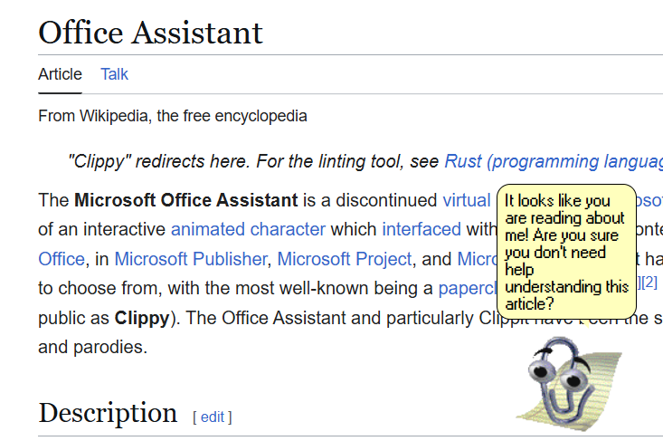

# Clippy



Remember me?

I'm Clippy. I used to help people write letters. Now I watch your screen and make unsolicited comments about what you're doing.

## Features

- Animated Clippy desktop companion
- Watches what's happening on your screen
- Periodically comments on what you're doing
- Slightly sarcastic personality
- Everything runs locally on your machine

## Setup

### 1. Install LM Studio

Download and install LM Studio:

https://lmstudio.ai

### 2. Download a model

Search for and download:

```text
google/gemma-4-e4b
```

### 3. Start the API server

In LM Studio:

```text
Developer → Local Server → Start Server
```

Leave the server running while using Clippy.

## Installation

```bash
yarn install
```

```bash
yarn tauri dev
```

To build:

```bash
yarn tauri build
```

## What does Clippy actually do?

Every so often, Clippy takes a look at your screen and reacts to whatever you're doing.

You might see things like:

> "It looks like you are simply staring at a screen. Perhaps I could explain how to actually _do_ something?"

> "Another YouTube tab? Research, I'm sure."

> "That TODO comment has been there for a while, hasn't it?"

> "You seem to have opened seventeen documentation pages instead of reading the first one."

He means well. Probably.

## Privacy

Everything happens locally:

- Screenshots never leave your computer.
- The AI runs through your local LM Studio server.
- No accounts, subscriptions, or telemetry.

The only thing watching you is Clippy... yay!

## Future Plans

- Better screen understanding
- Increased levels of sarcasm

## License

This project is licensed under the [MIT License](LICENSE).

_"It looks like you're making questionable decisions. Would you like help with that?"_
